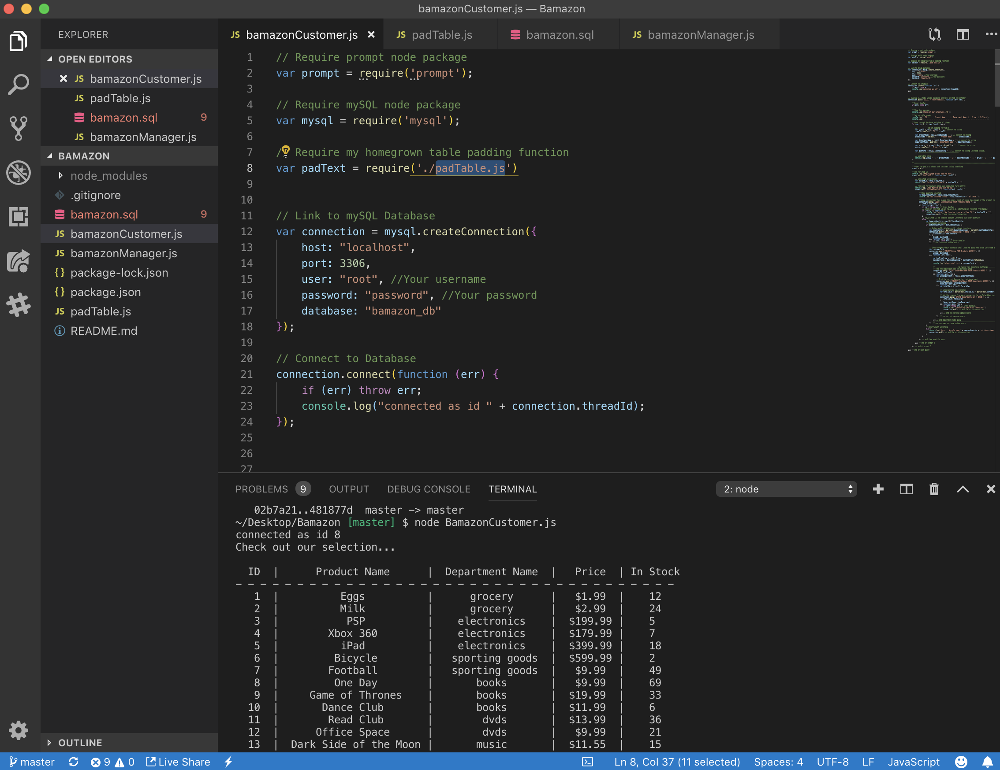
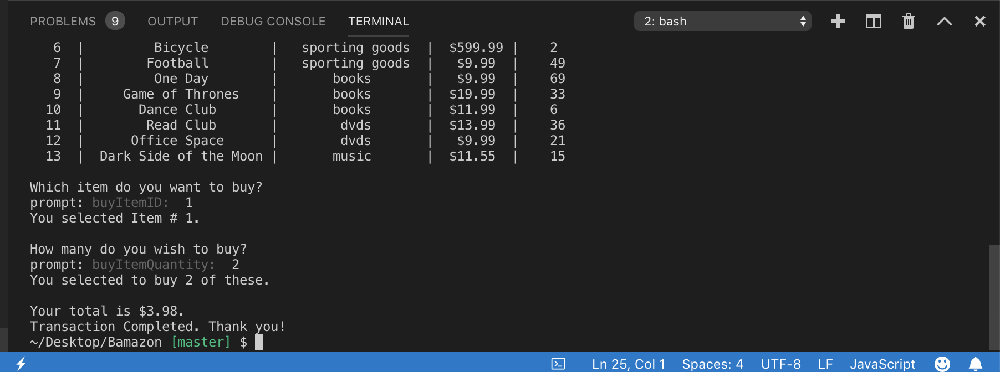
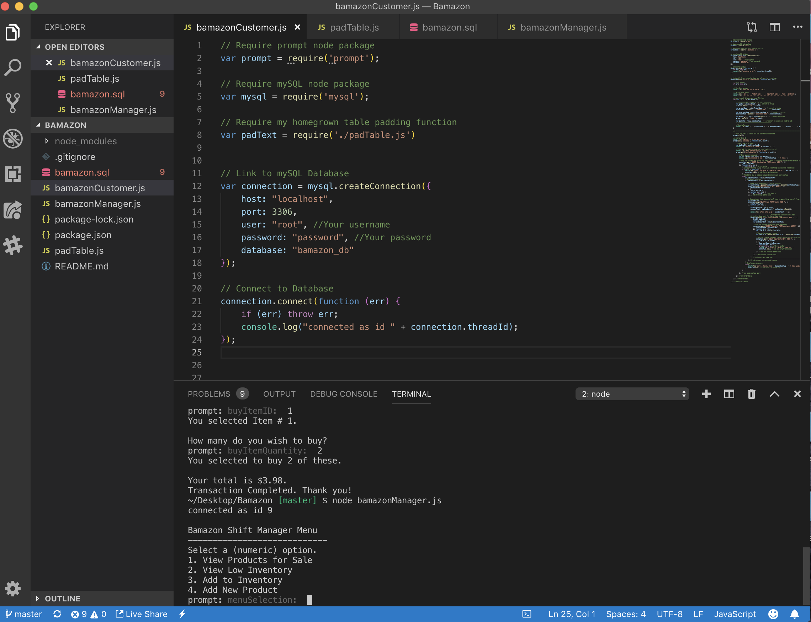
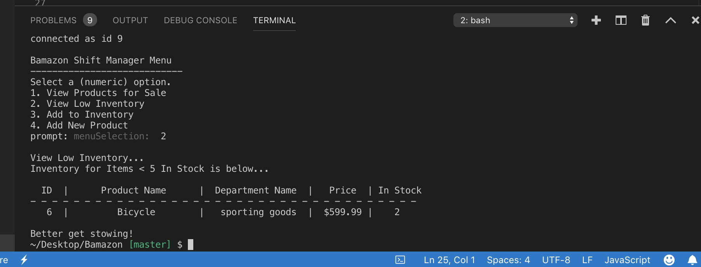
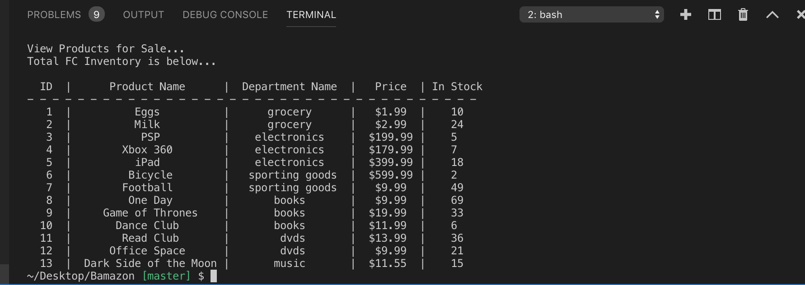

# Bamazon

## Overview
A Node.js & MySQL digital storefront. This is a command line Node app that mimics a beloved online retailer.

## Built With :
* Node.js
* Javascript
* MySQL

## Node.js
 Three JavaScript files replicate the basics of a simple ecommerce engine:

* bamazonCustomer.js 

Receives orders from customers via the command line and interfaces with mySQL to deplete stock from the store's inventory.

* bamazonManager.js 

Mimics the basics of a warehouse management system, providing managers with a list of options to view stock and adjust inventory.
A sample of the menu is below:
View Products for Sale
View Low Inventory
Add to Inventory
Add New Product

## MySQL
 The JavaScript files mentioned above query a MySQL database called bamazon_db which is locally hosted on my laptop.

Please refer to the bamazon.sql file to see how the database was created using SQL queries.

## To run the customer/manager interface please follow the steps below:

* git clone https://github.com/NadireGh/Bamazon.git
* cd BAMAZON
* npm install
* npm init -y
* node bamazonCustomer.js/ node bamazonManager.js

### ScreenShots

